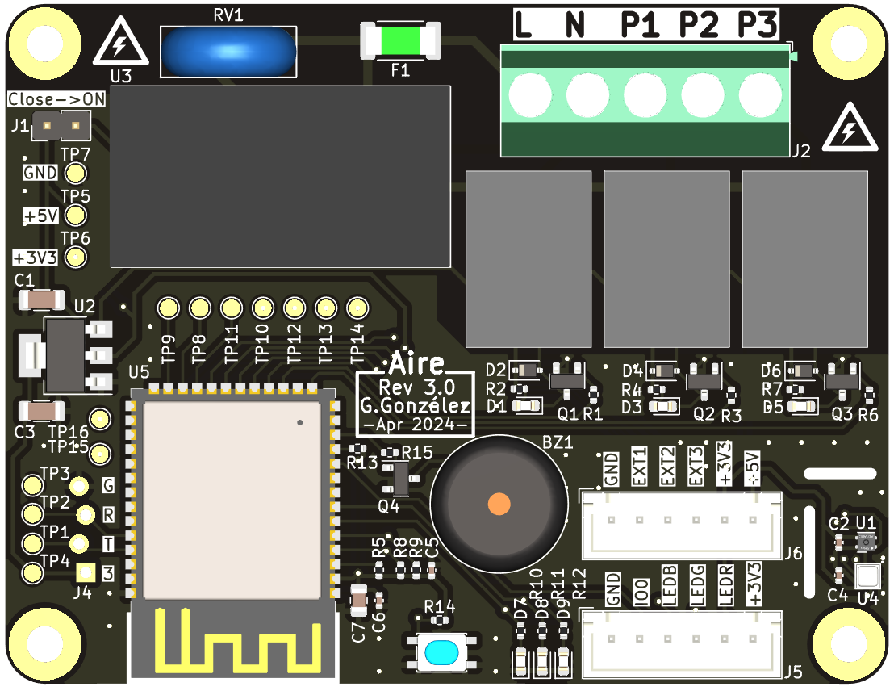

# Aire

## Description
'Aire' is a PCB designed to control a fan with three relays and automatize it with [Home Assistant](https://www.home-assistant.io/).

Firmware used in this device is [fw-aire](https://github.com/GuilleGonzzalez/fw-aire), a custom made firmware implemented using [Arduino Home Assistant](https://github.com/dawidchyrzynski/arduino-home-assistant/tree/main) Arduino library ([docs](https://dawidchyrzynski.github.io/arduino-home-assistant/)).

## Power supply
The board is powered with a 230VAC power supply.

## Microprocessor
Espressif [ESP8266](https://www.espressif.com/en/products/modules) module.

## Environmental sensing
The board has enviromental sensors to measure temperature, humidity and atmospheric pressure:

### Temperature and humidity sensor
* Sensirion [SHT40](https://sensirion.com/products/catalog/SHT40).

### Pressure sensor
* Bosch [BMP581](https://www.bosch-sensortec.com/products/environmental-sensors/pressure-sensors/bmp581/).
  
## LEDs and buttons (WIP)
The device has three LEDs for showing the status to the user.
* A power LED (LED1): shows the status of the fan.
* A general device LED (LED2): shows the status of the general air machine.
* A LED reserved for the future.

The device has a button for flash the firmware in the microcontroller, and is also used for the user.

The board has an external connector available for the three LEDs and the button.

## Pin assignment (WIP)
| PIN      | Func |
| -------- | ---- |
| GPIO    | FAN1  |
| GPIO    | FAN2  |
| GPIO    | FAN3  |
| GPIO    | LED1  |
| GPIO    | LED2  |
| GPIO    | LED3  |
| GPIO    | BUZZ  |
| GPIO0    | BTN  |

## Enclosure (WIP)
* Custom made

# Changelog
All notable changes to this project will be documented in this section.

The format is based on [Keep a Changelog](https://keepachangelog.com/en/1.0.0/)

[Unreleased]: https://github.com/GuilleGonzzalez/hw-aire
